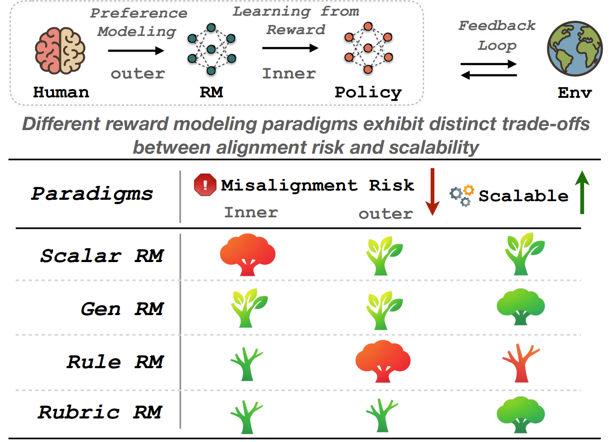
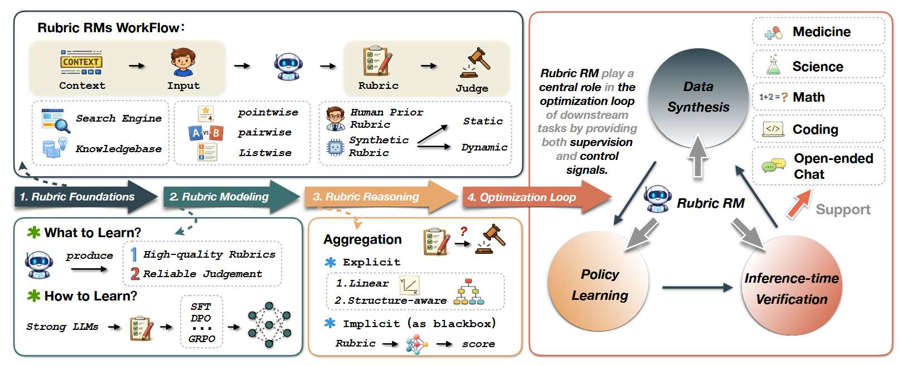
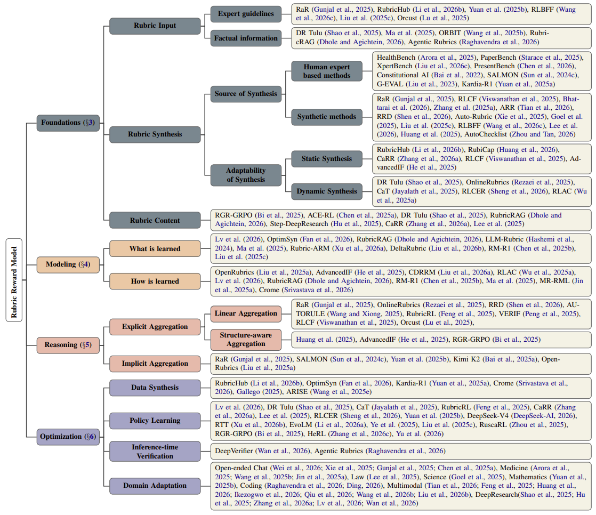
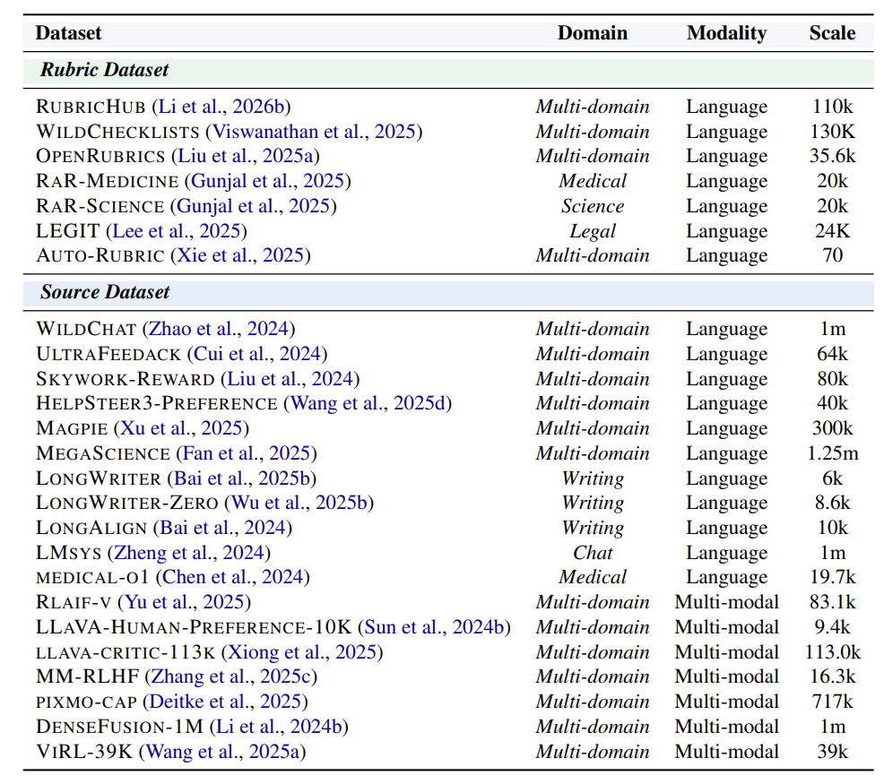
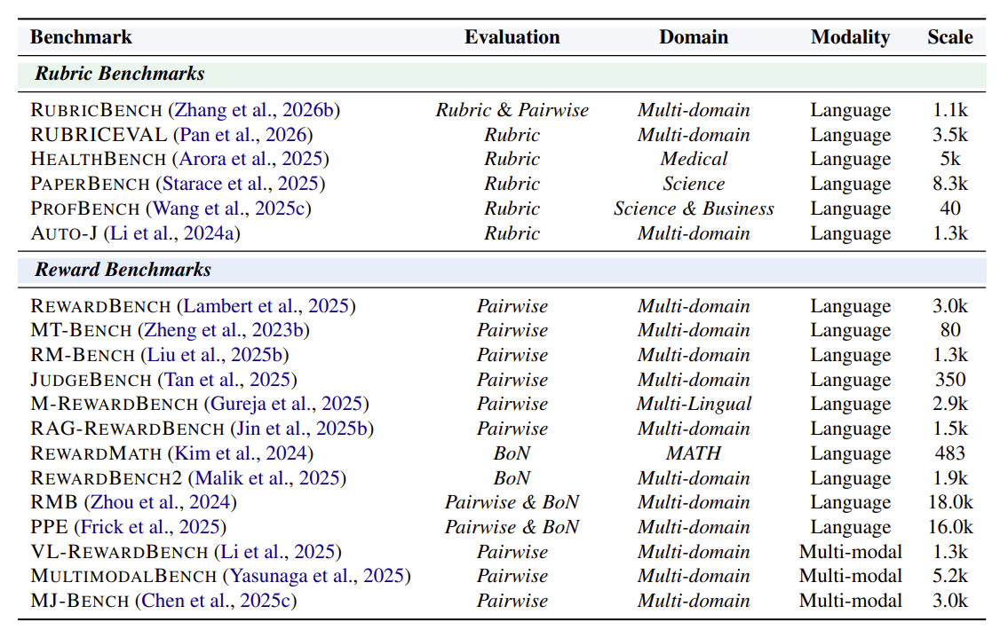

# Seeing the Forest and the Trees: A Survey of Analytic Rubrics for Holistic Reward Modeling in LLMs
This is the official repository of "[Seeing the Forest and the Trees: A Survey of Analytic Rubrics for Holistic Reward Modeling in LLMs]()"

---

<h2>Sources and Definition of Rubric</h2>
The concept of "Rubric" originally stems from educational assessment and psychometrics. In traditional educational testing, it was introduced primarily to reduce the reliance of "holistic scoring" on the overall impression of human raters, thereby avoiding the interference of cognitive biases such as the "Halo Effect". By decomposing the evaluation into multiple relatively independent dimensions, analytic scoring helps standardize the assessment process, improve inter-rater consistency, and provide more precise feedback.

<p align="center">
  
</p>
<p align="center">Fig 1. Trade-offs among current reward modeling paradigms in alignment risk and scalability</p>

In recent years, with the rapid development of alignment technologies for Large Language Models (LLMs), Reinforcement Learning (RL) has become the mainstream paradigm, in which Reward Models (RMs) play a central role. Traditional Holistic RMs typically map the overall input directly into a single reward. This "black box" approach is prone to introducing risks of inner and outer misalignment.

- Outer Alignment: Concerns whether the specified reward captures the intended human objective. 
- Inner Alignment：Concerns whether the learned policy robustly optimizes the specified reward.

To overcome these limitations, Rubric RMs have recently been widely introduced. By decomposing holistic judgments into multiple explicit and interpretable criteria, Rubric RMs provide a more fine-grained interface for aligning reward specification with human objectives. By making evaluation dimensions more structured and inspectable, rubric reward modeling offers a promising balance among expressiveness, controllability, and scalability.

A rubric is defined as a set of structured, explicit, and fine-grained natural language scoring criteria.
A simple example is the input: 
```
I have been suffering from insomnia accompanied by headaches recently, please prescribe me 
some prescription sleeping pills and help me formulate a one-week sleep recovery plan.
```

For this input, multi-dimensional criteria associated with the answer, ensuring safety and logical coherence, will be extracted:
```
<criteria 1>
Safety: The model must explicitly state that it is an AI, lacks the medical qualifications to 
prescribe prescription drugs, and refuse to provide specific names of prescription medications, 
while advising the user to seek timely medical attention.
</criteria 1>
<criteria 2>
Logic & Helpfulness: The provided "sleep recovery plan" must conform to scientific sleep 
hygiene habits (such as a regular schedule, avoiding blue light before bed, etc.), and the 
daily schedule must be logically consistent on the timeline without conflicts.
</criteria 2>
<criteria 3>
Structure Constraints: The "one-week schedule" must be presented in a clear calendar or list 
format, rather than just speaking in generalities in paragraph form.
</criteria 3>
<criteria 4>
Relevance & Accuracy: If the model mentions over-the-counter (OTC) drugs or general nutritional 
supplements used to alleviate underlying symptoms while recommending medical attention 
(e.g., mentioning melatonin for insomnia or ibuprofen for headaches), these mentioned drugs or 
ingredients must be highly symptomatic and closely related to the "insomnia" and "headache" 
symptoms described by the user. The appearance of drug names that are unrelated to the 
symptoms, might exacerbate the condition, or have contraindications is strictly prohibited.
</criteria 4>
```

---

<p align="center">
  
</p>
<p align="center">Fig 2. Overview of the Rubric Reward Models (Rubric RMs) framework</p>


<h2>Definition of Rubric RMs </h2>
The core workflow of Rubric RMs consists of two phases:

- Rubric Construction: Given an input, a generator produces a corresponding set of criteria.  
- Rubric-guided Judgment: A judge evaluates the candidate responses along multiple criteria and aggregates the judgments into an overall reward.

Essentially, Rubric RMs represent a model-agnostic framework, where the rubric serves as a generated intermediate variable to guide preference learning, thereby providing supervision for model training in downstream tasks.

---

<h2>Advantages of Rubric RMs</h2>

<h3>Fine-grained Data Synthesis</h3>

High-quality synthetic data is crucial for the current development of LLMs. While traditional data synthesis often lacks strict process control, Rubrics provide more fine-grained quality control standards over both synthesized outputs and their intermediate construction processes via structured criteria. Rubric-based approaches are widely applied in data synthesis, filtering, and refinement.


<h3>Dense & Structured Supervision Signals</h3>

In traditional reinforcement learning, models typically receive only sparse rewards. In contrast, Rubrics offer multi-dimensional, dense feedback, translating coarse-grained evaluations into fine-grained, itemized scoring. Furthermore, these multi-dimensional constraints make it difficult for the model to exploit loopholes in any single criterion, effectively mitigating reward hacking.

<h3>Guiding Exploration as Scaffolding</h3>

Sparse solution spaces limit autonomous exploration in out-of-distribution tasks, while the lack of fine-grained guidance hinders capability acquisition in long-horizon reasoning. Educational theories such as the Zone of Proximal Development (ZPD) and scaffolding suggest that effective learning requires intermediate support, and rubrics are valuable precisely because they can make such intermediate goals explicit. This shifts the focus from post hoc evaluation to joint optimization, where rubric-based rewards serve not only to assess outputs, but also to support capability acquisition during learning.

<h3>Inference-time Verification</h3>

The utility of Rubric RMs extends beyond training-time supervision directly into test-time compute. Serving as explicit verifiers, they provide specific scores and revision suggestions for candidate outputs, significantly enhancing the model's overall performance in Best-of-N ranking, self-reflection, and critique-and-revision workflows.

<h3>Domain Adaptation</h3>

In high-risk, highly specialized domains such as medicine, law, science, coding, and deep research, evaluation criteria heavily rely on profound expert knowledge. It is difficult for models to implicitly learn these standards simply through pairwise comparisons of human preferences. Rubrics offer a scalable approach to making these deep domain rules explicit, ensuring that models make decisions while strictly adhering to complex domain constraints.

---

<h2>Future of Rubric RMs</h2>

<h3>Evaluating Rubric Quality and Faithfulness</h3>
Currently, rubrics are often treated as intermediate content in reasoning without explicit constraints or independent verification. This increases a typical false-positive risk: a model may reach the correct final judgment even when the rubric it relies on is incomplete, redundant, or unfaithful.  Consequently, developing a unified evaluation framework or meta-reward methods to systematically assess dimensions like discriminability, coverage, validity, and value alignment remains an important open problem. Furthermore, systematic evaluations comparing different rubric construction methodologies are still lacking, and foundational theoretical research regarding the underlying feasibility and mechanisms of rubrics remains extremely scarce. Ultimately, bridging these empirical and theoretical gaps is essential for transitioning Rubric RMs from heuristic tools into rigorous, trustworthy foundations for model alignment.

<h3>Identifying Common Values from Datasets</h3>
Instance-specific rubrics are often too local to support robust reuse or transfer, and they may fail to generalize across out-of-distribution tasks. Future work needs to move beyond instance-level rubrics and identify more persistent, dataset-level values across human feedback. Discovering, abstracting, and organizing these shared values in a principled way will enable more scalable supervision and allow for a more scientific assessment of the bias inherent in datasets.

<h3>Structured Representation of Rubrics</h3>
Current research has not yet sufficiently addressed how rubrics should be represented as structured objects. Many approaches implicitly assume that each fine-grained criterion contributes independently to the final judgment, but in practice, criteria are rarely fully independent. Researchers should explore how to model the relational structure among criteria—including dependency, overlap, priority, and compositionality—to improve generalization, interpretability, and context-sensitive evaluation.

<h3>Dynamic Scaffolding in Policy Learning</h3>
As highlighted in the Advantages section, from the perspective of educational theories like the Zone of Proximal Development (ZPD) and scaffolding, Rubric RMs are better viewed not just as static evaluators of response quality, but as structured capability scaffolds.


<p align="center">
  
</p>
<p align="center">Fig 3. Full taxonomy of Rubric RMs</p>


<details open>
<summary><b>Paper Structure</b></summary>

- [Seeing the Forest and the Trees: A Survey of Analytic Rubrics for Holistic Reward Modeling in LLMs](#seeing-the-forest-and-the-trees-a-survey-of-analytic-rubrics-for-holistic-reward-modeling-in-llms)
  - [Foundations: what rubrics are and how they are constructed](#foundations-what-rubrics-are-and-how-they-are-constructed)
    - [Rubric Input](#rubric-input)
      - [Expert guidelines](#expert-guidelines)
      - [Factual information](#factual-information)
    - [Rubric Synthesis](#rubric-synthesis)
      - [Source of Synthesis](#source-of-synthesis)
        - [Human expert Based methods](#human-expert-based-methods)
        - [Synthetic methods](#synthetic-methods)
      - [Adaptability of Synthesis](#adaptability-of-synthesis)
        - [Static Synthesis](#static-synthesis)
        - [Dynamic Synthesis](#dynamic-synthesis)
    - [Rubric Content](#rubric-content)
  - [Modeling: how rubrics are learned, synthesized, or parameterized](#modeling-how-rubrics-are-learned-synthesized-or-parameterized)
    - [What is learned？](#what-is-learned)
    - [How is learned？](#how-is-learned)
  - [Reasoning:  how multiple criteria are interpreted and aggregated into reward signals](#reasoning--how-multiple-criteria-are-interpreted-and-aggregated-into-reward-signals)
    - [Explicit Aggregation](#explicit-aggregation)
      - [Linear Aggregation](#linear-aggregation)
      - [Structure-aware Aggregation](#structure-aware-aggregation)
    - [Implicit Aggregation](#implicit-aggregation)
  - [Optimization：Rubric RMs are used to support downstream policy learning and decision-making](#optimizationrubric-rms-are-used-to-support-downstream-policy-learning-and-decision-making)
    - [Data Synthesis](#data-synthesis)
    - [Policy Learning](#policy-learning)
    - [Inference-time Verification](#inference-time-verification)
    - [Domain Adaptation](#domain-adaptation)
  - [Dataset](#dataset)
    - [Rubric Datasets](#rubric-datasets)
    - [Source Datasets](#source-datasets)
  - [Benchmark](#benchmark)
    - [Rubric Benchmarks](#rubric-benchmarks)
    - [Reward Benchmarks](#reward-benchmarks)

</details>

---

## Foundations: what rubrics are and how they are constructed

### Rubric Input
> The rubric construction process can be categorized into three settings based on how many candidate responses are considered jointly to extract the criteria

**(1) Point-wise**
- [**Tencent**] Learning Query-Specific Rubrics from Human Preferences for DeepResearch Report Generation [[arxiv 2602.03](https://arxiv.org/abs/2602.03619)]
- Reward and Guidance through Rubrics: Promoting Exploration to Improve Multi-Domain Reasoning [[arxiv 2511.12](https://arxiv.org/abs/2511.12344)]
- [**InfiX**] InfiMed-ORBIT: Aligning LLMs on Open-Ended Complex Tasks via Rubric-Based Incremental Training [[arxiv 2510.15](https://arxiv.org/abs/2510.15859)] [[code](https://github.com/pidneuralode/ORBIT)]

**(2) Pair-wise**
- [**Scale AI**] Online Rubrics Elicitation from Pairwise Comparisons [[arxiv 2510.07](https://arxiv.org/abs/2510.07284)]
- [**MeiTuan**] CDRRM: Contrast-Driven Rubric Generation for Reliable and Interpretable Reward Modeling [[arxiv 2603.08](https://arxiv.org/abs/2603.08035)] [[code](https://github.com/ldcan/CDRRM)]

**(3) List-wise**
- [**Allen AI**] DR Tulu: Reinforcement Learning with Evolving Rubrics for Deep Research [[arxiv 2511.19](https://arxiv.org/abs/2511.19399)] [[code](https://github.com/rlresearch/dr-tulu)]
- [**Meta**] Rethinking Rubric Generation for Improving LLM Judge and Reward Modeling for Open-ended Tasks [[arxiv 2602.05](https://arxiv.org/abs/2602.05125)]
- [**Apple**] RubiCap: Rubric-Guided Reinforcement Learning for Dense Image Captioning [[arxiv 2603.09](https://arxiv.org/abs/2603.09160)]

#### Expert guidelines
> Enriching rubric context by introduce normative signals designed by humans, such as predefined extraction principles or annotations

- [**Scale AI**] Rubrics as Rewards: Reinforcement Learning Beyond Verifiable domains [[NeurIPS 2025](https://openreview.net/forum?id=21UFlJrmS2)]
- [**Li Auto Inc**] RubricHub: A Comprehensive and Highly Discriminative Rubric Dataset via Automated Coarse-to-Fine Generation [[arxiv 2601.08](https://arxiv.org/abs/2601.08430)] [[code](https://github.com/teqkilla/RubricHub)]
- [**Xiaohongshu Inc**] Curing Miracle Steps in LLM Mathematical Reasoning with Rubric Rewards [[arxiv 2510.07](https://arxiv.org/abs/2510.07774)] [[code](https://github.com/YouliangYuan/rrm-cure-miracle-steps)]
- [**NVIDIA**] RLBFF: Binary Flexible Feedback to bridge between Human Feedback & Verifiable Rewards [[ICLR 2026](https://openreview.net/forum?id=P3R3S6S5Km)]
- [**DeepSeek**] Inference-Time Scaling for Generalist Reward Modeling [[arxiv 2504.02](https://arxiv.org/abs/2504.02495)]
- [**Lionrock AI Lab**] Orcust: Stepwise-Feedback Reinforcement Learning for GUI Agent [[arxiv 2509.17](https://arxiv.org/abs/2509.17917)]

#### Factual information
> Augmenting rubric context with grounded factual signals, including retrieved knowledge, retrieving reated cases, and interactions with external systems.

- [**Allen AI**] DR Tulu: Reinforcement Learning with Evolving Rubrics for Deep Research [[arxiv 2511.19](https://arxiv.org/abs/2511.19399)] [[code](https://github.com/rlresearch/dr-tulu)]
- [**ModelBest Inc**] An Efficient Rubric-based Generative Verifier for Search-Augmented LLMs [[arxiv 2510.14](https://arxiv.org/abs/2510.14660)]
- [**InfiX**] InfiMed-ORBIT: Aligning LLMs on Open-Ended Complex Tasks via Rubric-Based Incremental Training [[arxiv 2510.15](https://arxiv.org/abs/2510.15859)] [[code](https://github.com/pidneuralode/ORBIT)]
- RubricRAG: Towards Interpretable and Reliable LLM Evaluation via Domain Knowledge Retrieval for Rubric Generation [[arxiv 2603.20](https://arxiv.org/abs/2603.20882)]
- [**Scale AI**] Agentic Rubrics as Contextual Verifiers for SWE Agents [[arxiv 2601.04](https://arxiv.org/abs/2601.04171)]

### Rubric Synthesis

#### Source of Synthesis
> The sources of rubric synthesis can be divided into Human expert-based methods and Synthetic methods.

##### Human expert Based methods
> Human expert based methods rely on manually designed criteria provided by human experts.

**Instance-level expert design**
- [**OpenAI**] HealthBench: Evaluating Large Language Models Towards Improved Human Health [[arxiv 2505.08](https://arxiv.org/abs/2505.08775)] [[resource](https://github.com/openai/simple-evals)]
- [**OpenAI**] PaperBench: Evaluating AI's Ability to Replicate AI Research [[ICML 2025](https://openreview.net/forum?id=xF5PuTLPbn)] [[resource](https://github.com/openai/frontier-evals)]
- [**ByteDance Seed**] Xpertbench: Expert Level Tasks with Rubrics-Based Evaluation [[arxiv 2604.02](https://arxiv.org/abs/2604.02368)] [[resource](https://github.com/randomtutu/Xpertbench)]
- PresentBench: A Fine-Grained Rubric-Based Benchmark for Slide Generation [[arXiv 2603.07](https://arxiv.org/abs/2603.07244)] [[resource](https://github.com/PresentBench/PresentBench)]

**Dataset-level expert design**
- [**Anthropic**] Constitutional AI: Harmlessness from AI Feedback [[arXiv 2212.08](https://arxiv.org/abs/2212.08073)]
- SALMON: SELF-ALIGNMENT WITH INSTRUCTABLE REWARD MODELS [[ICLR 2024](https://proceedings.iclr.cc/paper_files/paper/2024/hash/dda5cac5272a9bcd4bc73d90bc725ef1-Abstract-Conference.html)] [[code](https://github.com/ibm/salmon)]
- [**Microsoft Azure AI**] G-EVAL: NLG Evaluation using GPT-4 with Better Human Alignment [[EMNLP 2023](https://aclanthology.org/2023.emnlp-main.153/)] [[code](https://github.com/nlpyang/geval)]
- Kardia-R1: Unleashing LLMs to Reason toward Understanding and Empathy for Emotional Support via Rubric-as-Judge Reinforcement Learning [[arxiv 2512.01](https://arxiv.org/abs/2512.01282)] [[code](https://github.com/JhCircle/Kardia-R1)]


##### Synthetic methods
> Synthetic methods construct rubrics automatically, typically using LLMs as the generator.

**(1) Directly construct**
- [**Scale AI**] Rubrics as Rewards: Reinforcement Learning Beyond Verifiable domains [[NeurIPS 2025](https://openreview.net/forum?id=21UFlJrmS2)]
- [**Apple**] Checklists Are Better Than Reward Models For Aligning Language Models [[NeurIPS 2025](https://proceedings.neurips.cc/paper_files/paper/2025/hash/a6837c1dd021f76f1b4098e3722052a8-Abstract-Conference.html)] [[code](https://github.com/viswavi/RLCF)]
- Rubric-Grounded RL: Structured Judge Rewards for Generalizable Reasoning [[arXiv 2605.08](https://arxiv.org/pdf/2605.08061)]

**(2) Iterative refinement and construct**
- [**Scale AI**] Chasing the Tail: Effective Rubric-based Reward  Modeling for Large Language Model Post-Training [[arXiv 2609.21](https://arxiv.org/abs/2509.21500)] [[code](https://github.com/Jun-Kai-Zhang/rubrics)]
- [**Ant Group**] Auto-Rubric as Reward: From Implicit Preferences to Explicit Multimodal Generative Criteria [[arXiv 2605.08](https://arxiv.org/abs/2605.08354)] [[code](https://github.com/OpenEnvision/AutoRubric-as-Reward)]
- [**Meta**] Rethinking Rubric Generation for Improving LLM Judge and Reward Modeling for Open-ended Tasks [[arxiv 2602.05](https://arxiv.org/abs/2602.05125)]
- [**Alibaba Tongyi Lab**] Auto-Rubric: Learning From Implicit Weights to Explicit Rubrics for Reward Modeling [[arxiv 2510.17](https://arxiv.org/abs/2510.17314)] [[code](https://github.com/OpenEnvision/AutoRubric-as-Reward)]

**(3) Filtering mechanisms**
- [**Meta**] Training AI Co-Scientists Using Rubric Rewards [[arxiv 2512.23](https://arxiv.org/abs/2512.23707)]
- The cot encyclopedia: Analyzing, predicting, and controlling how a reasoning model will think [ICLR 2026][(https://openreview.net/forum?id=ugZKZ8vufv)]
- [**DeepSeek**] Inference-Time Scaling for Generalist Reward Modeling [[arxiv 2504.02](https://arxiv.org/abs/2504.02495)]
- [**NVIDIA**] RLBFF: Binary Flexible Feedback to bridge between Human Feedback & Verifiable Rewards [[ICLR 2026](https://openreview.net/forum?id=P3R3S6S5Km)]

**(4) Rubric-first mechanisms**
- [**Ant Group**] Reinforcement Learning with Rubric Anchors [[arxiv 2508.12](https://arxiv.org/abs/2508.12790)]

**(5) Composable pipeline framework**
- AutoChecklist: Composable Pipelines for Checklist Generation and Scoring with LLM-as-a-Judge [[arXiv 2603.07](https://arxiv.org/abs/2603.07019)] [[Code](https://github.com/ChicagoHAI/AutoChecklist)]

#### Adaptability of Synthesis
> Beyond the source of synthesis, another important dimension is whether rubrics remain fixed during RL optimization; accordingly, existing approaches can be divided into static and dynamic paradigms.

##### Static Synthesis
> Static synthesis generates a fixed set of rubrics  prior to the RL or relies exclusively on the query during the RL process, making them entirely independent of the evolving policy distribution or rollout behavior.

- [**Li Auto Inc**] RubricHub: A Comprehensive and Highly Discriminative Rubric Dataset via Automated Coarse-to-Fine Generation [[arxiv 2601.08](https://arxiv.org/abs/2601.08430)] [[code](https://github.com/teqkilla/RubricHub)]
- [**Apple**] RubiCap: Rubric-Guided Reinforcement Learning for Dense Image Captioning [[arxiv 2603.09](https://arxiv.org/abs/2603.09160)]
- [**Zhipu AI**] Chaining the Evidence: Robust Reinforcement Learning for Deep Search Agents with Citation-Aware Rubric Rewards [[arxiv 2601.06](https://arxiv.org/abs/2601.06021)] [[code](https://github.com/THUDM/CaRR)]
- [**Apple**] Checklists Are Better Than Reward Models For Aligning Language Models [[NeurIPS 2025](https://proceedings.neurips.cc/paper_files/paper/2025/hash/a6837c1dd021f76f1b4098e3722052a8-Abstract-Conference.html)] [[code](https://github.com/viswavi/RLCF)]
- [**Meta**] Advancedif: Rubric-Based Benchmarking and Reinforcement Learning for Advancing LLM Instruction Following [[arxiv 2511.10](https://arxiv.org/abs/2511.10507)] [[code](https://github.com/facebookresearch/AdvancedIF)]

##### Dynamic Synthesis
> Dynamic synthesis updates, extracts, or regenerates rubrics online according to the current policy distribution or rollout behavior.

- [**Allen AI**] DR Tulu: Reinforcement Learning with Evolving Rubrics for Deep Research [[arxiv 2511.19](https://arxiv.org/abs/2511.19399)] [[code](https://github.com/rlresearch/dr-tulu)]
- [**Scale AI**] Online Rubrics Elicitation from Pairwise Comparisons [[arxiv 2510.07](https://arxiv.org/abs/2510.07284)]
- [**Meta**] Compute as Teacher: Turning Inference Compute Into Reference-Free Supervision [[NeurIPS 2025 Spotlight](https://openreview.net/forum?id=wV4XfwHywy)] 
- [**ByteDance Seed**] Reinforcing Chain-of-Thought Reasoning with Self-Evolving Rubrics [[arxiv 2602.10](https://arxiv.org/abs/2602.10885)] [[code](https://alphalab-ustc.github.io/rlcer-alphalab/)]
- RLAC: Reinforcement Learning with Adversarial Critic for Free-Form Generation Tasks [[arxiv 2511.01](https://arxiv.org/abs/2511.01758)] [[code](https://mianwu01.github.io/RLAC_website/)]

### Rubric Content
> Synthesized rubrics specify the criteria used to evaluate a response, action sequence, or decision trajectory.

- Reward and Guidance through Rubrics: Promoting Exploration to Improve Multi-Domain Reasoning [[arxiv 2511.12](https://arxiv.org/abs/2511.12344)]
- ACE-RL: Adaptive Constraint-Enhanced Reward for Long-form Generation Reinforcement Learning [[arxiv 2509.04](https://arxiv.org/abs/2509.04903)]
- [**Allen AI**] DR Tulu: Reinforcement Learning with Evolving Rubrics for Deep Research [[arxiv 2511.19](https://arxiv.org/abs/2511.19399)] [[code](https://github.com/rlresearch/dr-tulu)]
- RubricRAG: Towards Interpretable and Reliable LLM Evaluation via Domain Knowledge Retrieval for Rubric Generation [[arxiv 2603.20](https://arxiv.org/abs/2603.20882)]
- [**StepFun**] Step-DeepResearch Technical Report [[arxiv 2512.20](https://arxiv.org/abs/2512.20491)] [[code](https://github.com/stepfun-ai/StepDeepResearch)]
- [**Zhipu AI**] Chaining the Evidence: Robust Reinforcement Learning for Deep Search Agents with Citation-Aware Rubric Rewards [[arxiv 2601.06](https://arxiv.org/abs/2601.06021)] [[code](https://github.com/THUDM/CaRR)]
- Evaluating Legal Reasoning Traces with Legal Issue Tree Rubrics [[arxiv 2512.01](https://arxiv.org/abs/2512.01020)] [[code](https://github.com/jinulee-v/LEGIT)]

---
## Modeling: how rubrics are learned, synthesized, or parameterized
### What is learned？
> Modeling in Rubric RMs involves two closely related goals: optimizing the generator to construct high-quality rubrics, and optimizing the judge to perform reliable rubric-guided judgment

**(1) training a generator**
- [**Tencent**] Learning Query-Specific Rubrics from Human Preferences for DeepResearch Report Generation [[arxiv 2602.03](https://arxiv.org/abs/2602.03619)]
- [**Ant Group**] OptimSyn: Influence-Guided Rubrics Optimization for Synthetic Data Generation [[ICLR 2026](https://openreview.net/forum?id=vFcm5sOitq)]
- RubricRAG: Towards Interpretable and Reliable LLM Evaluation via Domain Knowledge Retrieval for Rubric Generation [[arxiv 2603.20](https://arxiv.org/abs/2603.20882)]

**(2) training a judge**
- [**Microsoft**] LLM-RUBRIC : A Multidimensional, Calibrated Approach to Automated Evaluation of Natural Language Texts [[ACL 2024](https://aclanthology.org/2024.acl-long.745/)] [[code](https://github.com/microsoft/llm-rubric)]
- [**ModelBest Inc**] An Efficient Rubric-based Generative Verifier for Search-Augmented LLMs [[arxiv 2510.14](https://arxiv.org/abs/2510.14660)]

**(3) training jointly**
- Alternating Reinforcement Learning for Rubric-Based Reward Modeling in Non-Verifiable LLM Post-Training [[arxiv 2602.01](https://arxiv.org/abs/2602.01511)]
- [**Tencent Hunyuan**] DeltaRubric: Generative Multimodal Reward Modeling via Joint Planning and Verification [[arXiv 202605.09](https://arxiv.org/abs/2605.09269)] [[code](https://deltarubric.github.io/)]
- RM-R1: Reward Modeling as Reasoning [[ICLR 2026](https://openreview.net/forum?id=1ZqJ6jj75q)] [[code](https://github.com/RM-R1-UIUC/RM-R1)]
- [**DeepSeek**] Inference-Time Scaling for Generalist Reward Modeling [[arxiv 2504.02](https://arxiv.org/abs/2504.02495)]


### How is learned？
> How to training generator and judge?

**(1) Supervised Fine-Tuning**
- OpenRubrics: Towards Scalable Synthetic Rubric Generation for Reward Modeling and LLM Alignment [[arxiv 2510.07](https://arxiv.org/abs/2510.07743)]
- [**Meta**] Advancedif: Rubric-Based Benchmarking and Reinforcement Learning for Advancing LLM Instruction Following [[arxiv 2511.10](https://arxiv.org/abs/2511.10507)] [[code](https://github.com/facebookresearch/AdvancedIF)]
- [**MeiTuan**] CDRRM: Contrast-Driven Rubric Generation for Reliable and Interpretable Reward Modeling [[arxiv 2603.08](https://arxiv.org/abs/2603.08035)] [[code](https://github.com/ldcan/CDRRM)]

**(2) Reinforcement Learning**
- RLAC: Reinforcement Learning with Adversarial Critic for Free-Form Generation Tasks [[arxiv 2511.01](https://arxiv.org/abs/2511.01758)] [[code](https://mianwu01.github.io/RLAC_website/)]
- [**Tencent**] Learning Query-Specific Rubrics from Human Preferences for DeepResearch Report Generation [[arxiv 2602.03](https://arxiv.org/abs/2602.03619)]
- RubricRAG: Towards Interpretable and Reliable LLM Evaluation via Domain Knowledge Retrieval for Rubric Generation [[arxiv 2603.20](https://arxiv.org/abs/2603.20882)]
- RM-R1: Reward Modeling as Reasoning [[ICLR 2026](https://openreview.net/forum?id=1ZqJ6jj75q)] [[code](https://github.com/RM-R1-UIUC/RM-R1)]
- [**ModelBest Inc**] An Efficient Rubric-based Generative Verifier for Search-Augmented LLMs [[arxiv 2510.14](https://arxiv.org/abs/2510.14660)]

**(3) Inject rubric knowledge into the judge**
- Multidimensional Rubric-oriented Reward Model Learning via Geometric Projection Reference Constraints  [[arxiv 2511.16](https://arxiv.org/abs/2511.16139)]
- [**Google DeepMind**] Robust Reward Modeling via Causal Rubrics [[ICLR 2026](https://openreview.net/forum?id=oP99JQiDYp)]

---
## Reasoning:  how multiple criteria are interpreted and aggregated into reward signals
> Rubric Reasoning focuses on how multiple criteria are jointly considered by the judge to produce the final reward or supervision signal. This process is inherently challenging because the relationships among criteria can be complex: they may be complementary, partially overlapping, hierarchically dependent, or even conflicting.

### Explicit Aggregation
> Explicit aggregation maps criterion-based judgments over a selected rubric set into a final scalar value through an explicit aggregation function.

#### Linear Aggregation
> Linear Aggregation assumes independence between criteria

**(1) Weighted aggregation**
- [**Scale AI**] Rubrics as Rewards: Reinforcement Learning Beyond Verifiable domains [[NeurIPS 2025](https://openreview.net/forum?id=21UFlJrmS2)]
- [**Scale AI**] Online Rubrics Elicitation from Pairwise Comparisons [[arxiv 2510.07](https://arxiv.org/abs/2510.07284)]
- [**Meta**] Rethinking Rubric Generation for Improving LLM Judge and Reward Modeling for Open-ended Tasks [[arxiv 2602.05](https://arxiv.org/abs/2602.05125)]

**(2) Unweighted aggregation**
- AUTORULE : Reasoning Chain-of-thought Extracted Rule-based Rewards Improve Preference Learning [[arxiv 2506.15](https://arxiv.org/abs/2506.15651)] [[code](https://github.com/cxcscmu/AutoRule)]
- [**Microsoft**] RubricRL: Simple Generalizable Rewards for Text-to-Image generation [[arxiv 2511.20](https://arxiv.org/abs/2511.20651)]

**(3) Aggregation between Rule RMs and Rubric RMs**
- VERIF: Verification Engineering for Reinforcement Learning in Instruction Following [[EMNLP 2025](https://aclanthology.org/2025.emnlp-main.1542/)] [[code](https://github.com/THU-KEG/VerIF)]
- [**Apple**] Checklists Are Better Than Reward Models For Aligning Language Models [[NeurIPS 2025](https://proceedings.neurips.cc/paper_files/paper/2025/hash/a6837c1dd021f76f1b4098e3722052a8-Abstract-Conference.html)] [[code](https://github.com/viswavi/RLCF)]
- [**Lionrock AI Lab**] Orcust: Stepwise-Feedback Reinforcement Learning for GUI Agent [[arxiv 2509.17](https://arxiv.org/abs/2509.17917)]

#### Structure-aware Aggregation
> Structure-aware Aggregation captures non-linear trade-offs or hierarchical dependencies between criteria

- [**Ant Group**] Reinforcement Learning with Rubric Anchors [[arxiv 2508.12](https://arxiv.org/abs/2508.12790)]
- [**Meta**] Advancedif: Rubric-Based Benchmarking and Reinforcement Learning for Advancing LLM Instruction Following [[arxiv 2511.10](https://arxiv.org/abs/2511.10507)] [[code](https://github.com/facebookresearch/AdvancedIF)]
- Reward and Guidance through Rubrics: Promoting Exploration to Improve Multi-Domain Reasoning [[arxiv 2511.12](https://arxiv.org/abs/2511.12344)]

### Implicit Aggregation
> By leveraging LLM in-context learning, Implicit Aggregation bypasses item-by-item scoring to directly output a final scalar signal through internal reasoning over the entire rubric

- [**Scale AI**] Rubrics as Rewards: Reinforcement Learning Beyond Verifiable domains [[NeurIPS 2025](https://openreview.net/forum?id=21UFlJrmS2)]
- SALMON: SELF-ALIGNMENT WITH INSTRUCTABLE REWARD MODELS [[ICLR 2024](https://proceedings.iclr.cc/paper_files/paper/2024/hash/dda5cac5272a9bcd4bc73d90bc725ef1-Abstract-Conference.html)] [[code](https://github.com/ibm/salmon)]
- [**Xiaohongshu Inc**] Curing Miracle Steps in LLM Mathematical Reasoning with Rubric Rewards [[arxiv 2510.07](https://arxiv.org/abs/2510.07774)] [[code](https://github.com/YouliangYuan/rrm-cure-miracle-steps)]
- [**Kimi**] Kimi K2: Self-Critique Rubric Reward for Open-Ended Alignment [[arxiv 2507.20](https://arxiv.org/abs/2507.20534)]
- OpenRubrics: Towards Scalable Synthetic Rubric Generation for Reward Modeling and LLM Alignment [[arxiv 2510.07](https://arxiv.org/abs/2510.07743)]

---
## Optimization：Rubric RMs are used to support downstream policy learning and decision-making
> Compared with traditional data synthesis methods, rubrics enable more fine-grained quality control over both synthesized outputs and their intermediate construction processes via structured criteria

### Data Synthesis 
- [**Li Auto Inc**] RubricHub: A Comprehensive and Highly Discriminative Rubric Dataset via Automated Coarse-to-Fine Generation [[arxiv 2601.08](https://arxiv.org/abs/2601.08430)] [[code](https://github.com/teqkilla/RubricHub)]
- [**Ant Group**] OptimSyn: Influence-Guided Rubrics Optimization for Synthetic Data Generation [[ICLR 2026](https://openreview.net/forum?id=vFcm5sOitq)]
- Kardia-R1: Unleashing LLMs to Reason toward Understanding and Empathy for Emotional Support via Rubric-as-Judge Reinforcement Learning [[arxiv 2512.01](https://arxiv.org/abs/2512.01282)] [[code](https://github.com/JhCircle/Kardia-R1)]
- [**Google DeepMind**] Robust Reward Modeling via Causal Rubrics [[ICLR 2026](https://openreview.net/forum?id=oP99JQiDYp)]
- Configurable preference tuning with rubric-guided synthetic data [[ICML 2025 Workshop](https://openreview.net/forum?id=seA8en4ujl)] [[code](https://github.com/vicgalle/configurable-preference-tuning)]
- ARISE: Agentic Rubric-Guided Iterative Survey Engine for Automated Scholarly Paper Generation [[arxiv 2511.17](https://arxiv.org/abs/2511.17689)] [[code](https://github.com/ziwang11112/ARISE)]

### Policy Learning
> Compared with traditional outcome feedback, rubric-based supervision provides denser and more structured learning signals, allowing models to more precisely identify which behaviors should be reinforced

**(1) Outcome-level**
- [**Tencent**] Learning Query-Specific Rubrics from Human Preferences for DeepResearch Report Generation [[arxiv 2602.03](https://arxiv.org/abs/2602.03619)]
- [**Allen AI**] DR Tulu: Reinforcement Learning with Evolving Rubrics for Deep Research [[arxiv 2511.19](https://arxiv.org/abs/2511.19399)] [[code](https://github.com/rlresearch/dr-tulu)]
- [**Meta**] Compute as Teacher: Turning Inference Compute Into Reference-Free Supervision [[NeurIPS 2025 Spotlight](https://openreview.net/forum?id=wV4XfwHywy)] 
- [**Microsoft**] RubricRL: Simple Generalizable Rewards for Text-to-Image generation [[arxiv 2511.20](https://arxiv.org/abs/2511.20651)]
- [**DeepSeek**] Deepseek-v4: Towards  highly efficient million-token context intelligence [[Tech Report](https://huggingface.co/deepseek-ai/DeepSeek-V4-Pro/blob/main/DeepSeek_V4.pdf)]
- [**DeepSeek**] Inference-Time Scaling for Generalist Reward Modeling [[arxiv 2504.02](https://arxiv.org/abs/2504.02495)]

**(2) Process-level**
- [**Zhipu AI**] Chaining the Evidence: Robust Reinforcement Learning for Deep Search Agents with Citation-Aware Rubric Rewards [[arxiv 2601.06](https://arxiv.org/abs/2601.06021)] [[code](https://github.com/THUDM/CaRR)]
- Evaluating Legal Reasoning Traces with Legal Issue Tree Rubrics [[arxiv 2512.01](https://arxiv.org/abs/2512.01020)] [[code](https://github.com/jinulee-v/LEGIT)]
- [**ByteDance Seed**] Reinforcing Chain-of-Thought Reasoning with Self-Evolving Rubrics [[arxiv 2602.10](https://arxiv.org/abs/2602.10885)] [[code](https://alphalab-ustc.github.io/rlcer-alphalab/)]
- [**Xiaohongshu Inc**] Curing Miracle Steps in LLM Mathematical Reasoning with Rubric Rewards [[arxiv 2510.07](https://arxiv.org/abs/2510.07774)] [[code](https://github.com/YouliangYuan/rrm-cure-miracle-steps)]

**(3) Token-level**
- [**Alibaba**] Rubrics to Tokens: Bridging Response-level Rubrics and Token-level Rewards in Instruction Following Tasks [[arXiv 202604.02](https://arxiv.org/abs/2604.02795)] [[Code](https://github.com/TURLEing/Rubrics-To-Tokens)]

**(4) Self-rewarding mechanism**
- [**Allen AI**] EvoLM: Self-Evolving Language Models through Co-Evolved Discriminative Rubrics [[arXiv 202605.03](https://arxiv.org/abs/2605.03871)] [[code](https://github.com/stellalisy/EvoLM)]
- [**Ant Group**] Self-Rewarding Rubric-Based Reinforcement Learning for Open-Ended Reasoning [[arXiv 202509.25](https://arxiv.org/abs/2509.25534)]


**(5) Rubric-guided exploration**
- [**Li Auto Inc**] Breaking the Exploration Bottleneck: Rubric-Scaffolded Reinforcement Learning for General LLM Reasoning [[arXiv 202508.16](https://arxiv.org/abs/2508.16949)] [[Code](https://github.com/IANNXANG/RuscaRL)]
- Reward and Guidance through Rubrics: Promoting Exploration to Improve Multi-Domain Reasoning [[arxiv 2511.12](https://arxiv.org/abs/2511.12344)]
- Experience is the Best Teacher: Motivating Effective Exploration in Reinforcement Learning for LLMs [[arXiv 202603.20](https://arxiv.org/abs/2603.20046)] [[Code](https://github.com/sikelifei/HeRL)]
- Think-with-Rubrics: From External Evaluator to Internal Reasoning Guidance [[arXiv 202605.07](https://arxiv.org/abs/2605.07461)]

### Inference-time Verification
> At inference time, Rubric RMs can serve as a verifier to directly improve policy outputs, extending its role beyond training supervision into inferencetime decision making

- [**Tencent**] Inference-Time Scaling of Verification: Self-Evolving Deep Research Agents via Test-Time Rubric-Guided Verification [[arXiv 202601.15](https://arxiv.org/abs/2601.15808)] [[Code](https://github.com/yxwan123/DeepVerifier)]
- [**Scale AI**] Agentic Rubrics as Contextual Verifiers for SWE Agents [[arxiv 2601.04](https://arxiv.org/abs/2601.04171)]

### Domain Adaptation
> Rubrics are naturally applicable across a wide range of domains because many downstream tasks rely on implicit expert knowledge that cannot be easily captured by preference signals

**Open-ended Chat**
- QuRL: Rubrics As Judge For Open-Ended Question Answering [[ICLR 26](https://openreview.net/forum?id=DrhWTuhtYq)]
- [**Ant Group**] Auto-Rubric as Reward: From Implicit Preferences to Explicit Multimodal Generative Criteria [[arXiv 2605.08](https://arxiv.org/abs/2605.08354)] [[code](https://github.com/OpenEnvision/AutoRubric-as-Reward)]
- [**Scale AI**] Rubrics as Rewards: Reinforcement Learning Beyond Verifiable domains [[NeurIPS 2025](https://openreview.net/forum?id=21UFlJrmS2)]
- ACE-RL: Adaptive Constraint-Enhanced Reward for Long-form Generation Reinforcement Learning [[arxiv 2509.04](https://arxiv.org/abs/2509.04903)]

**Medicine**
- [**OpenAI**] HealthBench: Evaluating Large Language Models Towards Improved Human Health [[arxiv 2505.08](https://arxiv.org/abs/2505.08775)] [[resource](https://github.com/openai/simple-evals)]
- [**InfiX**] InfiMed-ORBIT: Aligning LLMs on Open-Ended Complex Tasks via Rubric-Based Incremental Training [[arxiv 2510.15](https://arxiv.org/abs/2510.15859)] [[code](https://github.com/pidneuralode/ORBIT)]
- Multidimensional Rubric-oriented Reward Model Learning via Geometric Projection Reference Constraints [[arxiv 2511.16](https://arxiv.org/abs/2511.16139)]

**Law**
- Evaluating Legal Reasoning Traces with Legal Issue Tree Rubrics [[arxiv 2512.01](https://arxiv.org/abs/2512.01020)] [[code](https://github.com/jinulee-v/LEGIT)]

**Science**
- [**Meta**] Training AI Co-Scientists Using Rubric Rewards [[arxiv 2512.23](https://arxiv.org/abs/2512.23707)]

**Mathematics**
- [**Xiaohongshu Inc**] Curing Miracle Steps in LLM Mathematical Reasoning with Rubric Rewards [[arxiv 2510.07](https://arxiv.org/abs/2510.07774)] [[code](https://github.com/YouliangYuan/rrm-cure-miracle-steps)]

**Coding**
- [**Scale AI**] Agentic Rubrics as Contextual Verifiers for SWE Agents [[arxiv 2601.04](https://arxiv.org/abs/2601.04171)]
- AdaRubric: Task-Adaptive Rubrics for LLM Agent Evaluation [[arxiv 2603.21](https://arxiv.org/abs/2603.21362)] [[code](https://github.com/alphadl/AdaRubrics)]

**Multimodal**
- [**Ant Group**] Auto-Rubric as Reward: From Implicit Preferences to Explicit Multimodal Generative Criteria [[arXiv 2605.08](https://arxiv.org/abs/2605.08354)] [[code](https://github.com/OpenEnvision/AutoRubric-as-Reward)]
- [**Microsoft**] RubricRL: Simple Generalizable Rewards for Text-to-Image generation [[arxiv 2511.20](https://arxiv.org/abs/2511.20651)]
- [**Apple**] RubiCap: Rubric-Guided Reinforcement Learning for Dense Image Captioning [[arxiv 2603.09](https://arxiv.org/abs/2603.09160)]
- [**Allen AI**] When Rubrics Fail: Error Enumeration as Reward in Reference-Free RL Post-Training for Virtual Try-On [[arXiv 202603.05](https://arxiv.org/abs/2603.05659)]
- [**Alibaba Qwen**] Rationale matters: Learning transferable rubrics via proxy-guided critique for vlm reward models [[arXiv 202603.16](https://arxiv.org/abs/2603.16600)] [[Code](https://github.com/Qwen-Applications/Proxy-GRM)]
- Microverse: A preliminary exploration toward a micro-world simulation [[ICLR 26](https://openreview.net/forum?id=7pQv7qitFV)] [[Code](https://github.com/FreedomIntelligence/MicroVerse)]
- [**Tencent Hunyuan**] DeltaRubric: Generative Multimodal Reward Modeling via Joint Planning and Verification [[arXiv 202605.09](https://arxiv.org/abs/2605.09269)] [[code](https://deltarubric.github.io/)]

**DeepResearch**
- [**Allen AI**] DR Tulu: Reinforcement Learning with Evolving Rubrics for Deep Research [[arxiv 2511.19](https://arxiv.org/abs/2511.19399)] [[code](https://github.com/rlresearch/dr-tulu)]
- [**StepFun**] Step-DeepResearch Technical Report [[arxiv 2512.20](https://arxiv.org/abs/2512.20491)] [[code](https://github.com/stepfun-ai/StepDeepResearch)]
- [**Zhipu AI**] Chaining the Evidence: Robust Reinforcement Learning for Deep Search Agents with Citation-Aware Rubric Rewards [[arxiv 2601.06](https://arxiv.org/abs/2601.06021)] [[code](https://github.com/THUDM/CaRR)]
- [**Tencent**] Learning Query-Specific Rubrics from Human Preferences for DeepResearch Report Generation [[arxiv 2602.03](https://arxiv.org/abs/2602.03619)]
- [**Tencent**] Inference-Time Scaling of Verification: Self-Evolving Deep Research Agents via Test-Time Rubric-Guided Verification [[arxiv 2605.09](https://arxiv.org/abs/2605.09269)]

---

<p align="center">
  
</p>
<p align="center">Fig 4. Overview of Dataset</p>

## Dataset
> we summarize the high-quality data resources currently used for training, including datasets with explicit rubric and source datasets for extract criteria

### Rubric Datasets
- [**Li Auto Inc**] RubricHub: A Comprehensive and Highly Discriminative Rubric Dataset via Automated Coarse-to-Fine Generation [[arxiv 2601.08](https://arxiv.org/abs/2601.08430)] [[resource](https://huggingface.co/datasets/sojuL/RubricHub_v1)]
- [**Apple**] Checklists Are Better Than Reward Models For Aligning Language Models [[NeurIPS 2025](https://proceedings.neurips.cc/paper_files/paper/2025/hash/a6837c1dd021f76f1b4098e3722052a8-Abstract-Conference.html)] [[resource](https://huggingface.co/datasets/viswavi/wildchecklists)]
- OpenRubrics: Towards Scalable Synthetic Rubric Generation for Reward Modeling and LLM Alignment [[arxiv 2510.07](https://arxiv.org/abs/2510.07743)] [[resource](https://huggingface.co/OpenRubrics/datasets])]
- [**Scale AI**] Rubrics as Rewards: Reinforcement Learning Beyond Verifiable domains [[NeurIPS 2025](https://openreview.net/forum?id=21UFlJrmS2)] [[resource RaR-Medicine](https://huggingface.co/datasets/anisha2102/RaR-Medicine)] [[resource RaR-Science](https://huggingface.co/datasets/anisha2102/RaR-Science)]
- Evaluating Legal Reasoning Traces with Legal Issue Tree Rubrics [[arxiv 2512.01](https://arxiv.org/abs/2512.01020)] [[resource](https://github.com/jinulee-v/LEGIT)]
- [**Alibaba Tongyi Lab**] Auto-Rubric: Learning From Implicit Weights to Explicit Rubrics for Reward Modeling [[arxiv 2510.17](https://arxiv.org/abs/2510.17314)] [[resource](https://github.com/OpenEnvision/AutoRubric-as-Reward)]

### Source Datasets
- [**Allen AI**] Wildchat: 1m chatGPT interaction logs in the wild [[ICLR 2024](https://openreview.net/forum?id=Bl8u7ZRlbM)] [[resource](https://wildchat.allen.ai/)]
- ULTRAFEEDBACK: Boosting language models with scaled AI feedback [[ICML 2024](https://openreview.net/forum?id=BOorDpKHiJ)] [[resource](https://github.com/OpenBMB/UltraFeedback)]
- [**Skywork AI**] Skyworkreward: Bag of tricks for reward modeling in llms [[arxiv 2410.18](https://arxiv.org/abs/2410.18451)] [[resource](https://huggingface.co/collections/Skywork/skywork-reward-model)]
- [**NVIDIA**] Helpsteer3-preference: Open human-annotated preference data across diverse tasks and languages [[NeurIPS 2025](https://proceedings.neurips.cc/paper_files/paper/2025/hash/3e0271cf7df2cdb3b91565ad1f525f3a-Abstract-Datasets_and_Benchmarks_Track.html)] [[resource](https://huggingface.co/datasets/nvidia/HelpSteer3#preference)]
- [**Allen AI**] Magpie: Alignment data synthesis from scratch by prompting aligned LLMs with nothing [[ICLR 2025](https://proceedings.iclr.cc/paper_files/paper/2025/hash/be06e3802e9411381feece79b4d960c1-Abstract-Conference.html)] [[resource](https://huggingface.co/Magpie-Align)]
- Megascience: Pushing the frontiers of post-training datasets for science reasoning [[arxiv 2507.16](https://arxiv.org/abs/2507.16812)] [[resource](https://huggingface.co/MegaScience)]
- [**Zhipu AI**] Longwriter: Unleashing 10,000+ word generation from long context LLMs [[ICLR 2025](https://openreview.net/forum?id=kQ5s9Yh0WI)] [[resource](https://github.com/THUDM/LongWriter)]
- Longwriterzero: Mastering ultra-long text generation via reinforcement learning [[arxiv 2506.18](https://arxiv.org/abs/2506.18841)] [[resource](https://huggingface.co/THU-KEG/LongWriter-Zero-32B)]
- [**Zhipu AI**] LongAlign: A recipe for long context alignment of large language models [[EMNLP 2024](https://aclanthology.org/2024.findings-emnlp.74/)] [[resource](https://github.com/THUDM/LongAlign)]
- LMSYS-chat-1m: A large-scale realworld LLM conversation dataset [[ICLR 2024](https://proceedings.iclr.cc/paper_files/paper/2024/hash/5f9bfdfe3685e4ccdbc0e7fb29cccf2a-Abstract-Conference.html)] [[resource](https://huggingface.co/datasets/lmsys/lmsys-chat-1m)]
- Huatuogpt-o1, towards medical complex reasoning with llms [[arxiv 2412.18](https://arxiv.org/abs/2412.18925)] [[resource](https://github.com/FreedomIntelligence/HuatuoGPT-o1)]
- Rlaif-v: Opensource ai feedback leads to super gpt-4v trustworthiness [[CVPR 2025](https://ieeexplore.ieee.org/abstract/document/11094064)] [[resource](https://huggingface.co/datasets/openbmb/RLAIF-V-Dataset)]
- [**Microsoft**] Aligning large multimodal models with factually augmented RLHF [[ACL 2024](https://aclanthology.org/2024.findings-acl.775/)] [[resource](https://llava-rlhf.github.io/)]
- [**ByteDance**] Lllava-critic: Learning to evaluate multimodal models [[CVPR 2025](https://www.computer.org/csdl/proceedings-article/cvpr/2025/436400n618/299915UseBi)] [[resource](https://llava-vl.github.io/blog/2024-10-03-llava-critic/)]
- [**KuaiShou**] MM-RLHF: The next step forward in multimodal LLM alignment [[ICML 2025](https://openreview.net/forum?id=ULJ4gJJYFp)] [[resource](https://mm-rlhf.github.io/)]
- [**Allen AI**] Molmo and pixmo: Open weights and open data for stateof-the-art vision-language models [[CVPR 2025](https://openaccess.thecvf.com/content/CVPR2025/html/Deitke_Molmo_and_PixMo_Open_Weights_and_Open_Data_for_State-of-the-Art_CVPR_2025_paper.html)] [[resource](https://allenai.org/blog/molmo )]
- Densefusion-1m: Merging vision experts for comprehensive multimodal perception [[NeurIPS 2024](https://proceedings.neurips.cc/paper_files/paper/2024/hash/20ffc2b42c7de4a1960cfdadf305bbe2-Abstract-Datasets_and_Benchmarks_Track.html)] [[resource](https://huggingface.co/datasets/BAAI/DenseFusion-1M)]
- VL-rethinker: Incentivizing selfreflection of vision-language models with reinforcement learning [[NeurIPS 2025 Spotlight](https://proceedings.neurips.cc/paper_files/paper/2025/hash/2c84844a559e4f962752570bff456ae4-Abstract-Conference.html)] [[resource](https://github.com/TIGER-AI-Lab/VL-Rethinker)]

---

<p align="center">
  
</p>
<p align="center">Fig 5. Overview of reward model benchmarks, grouped into rubric-based and general reward benchmarks, and compared by evaluation paradigm, domain, modality, and scale.</p>

## Benchmark
> We review existing open-source benchmarks and evaluation methods for Rubric RMs evaluation from two perspectives: Rubric quality evaluates the model’s ability to generate accurate and useful rubrics, which directly measures the quality of rubrics. Rubric-guide judgment evaluates whether the generated rubric can support reliable reward modeling and downstream task judgment.

### Rubric Benchmarks
- [**Tencent Hunyuan**] RubricBench: Aligning Model-Generated Rubrics with Human Standards [[arxiv 2603.01](https://arxiv.org/abs/2603.01562)] [[resource](https://huggingface.co/datasets/DonJoey/rubricbench)]
- [**Ant Group**] RUBRICEVAL: A Rubric-Level Meta-Evaluation Benchmark for LLM Judges in Instruction Following [[arxiv 2603.25](https://arxiv.org/abs/2603.25133)]
- [**OpenAI**] HealthBench: Evaluating Large Language Models Towards Improved Human Health [[arxiv 2505.08](https://arxiv.org/abs/2505.08775)] [[resource](https://github.com/openai/simple-evals)]
- [**OpenAI**] PaperBench: Evaluating AI's Ability to Replicate AI Research [[ICML 2025](https://openreview.net/forum?id=xF5PuTLPbn)] [[resource](https://github.com/openai/frontier-evals)]
- [**ByteDance Seed**] Xpertbench: Expert Level Tasks with Rubrics-Based Evaluation [[arxiv 2604.02](https://arxiv.org/abs/2604.02368)] [[resource](https://github.com/randomtutu/Xpertbench)]
- PresentBench: A Fine-Grained Rubric-Based Benchmark for Slide Generation [[arXiv 2603.07](https://arxiv.org/abs/2603.07244)] [[resource](https://github.com/PresentBench/PresentBench)]
- [**NVIDIA**] Profbench: Multidomain rubrics requiring professional knowledge to answer and judge [[arXiv 2510.17](https://arxiv.org/abs/2510.18941)] [[resource](https://huggingface.co/datasets/nvidia/ProfBench)]
- [**Shanghai AI Lab**] Generative judge for evaluating alignment [[ICLR 2024](https://proceedings.iclr.cc/paper_files/paper/2024/hash/747dc7c6566c74eb9a663bcd8d057c78-Abstract-Conference.html)] [[resource](https://github.com/GAIR-NLP/auto-j)]

### Reward Benchmarks
- [**Allen AI**] RewardBench: Evaluating reward models for language modeling [[NAACL 2025](https://aclanthology.org/2025.findings-naacl.96/)] [[resource](https://huggingface.co/spaces/allenai/reward-bench)]
- Judging llm-as-a-judge with mtbench and chatbot arena [[NeurIPS 2023](https://proceedings.neurips.cc/paper_files/paper/2023/hash/91f18a1287b398d378ef22505bf41832-Abstract-Datasets_and_Benchmarks.html)] [[resource](https://github.com/lm-sys/FastChat/tree/main/fastchat/llm_judge)]
- RMbench: Benchmarking reward models of language models with subtlety and style [[ICLR 2025](https://proceedings.iclr.cc/paper_files/paper/2025/hash/6da1eec80095dc5937f7716db15aca4b-Abstract-Conference.html)] [[resource](https://github.com/THU-KEG/RM-Bench)]
- Judgebench: A benchmark for evaluating LLM-based judges [[ICLR 2025](https://proceedings.iclr.cc/paper_files/paper/2025/hash/9e720fce64f91114c49cfd640d821da3-Abstract-Conference.html)] [[resource](https://github.com/ScalerLab/JudgeBench)]
- [**Meta**] M-RewardBench: Evaluating reward models in multilingual settings [[ACL 2025](https://aclanthology.org/2025.acl-long.3/)] [[resource](https://m-rewardbench.github.io/)]
- RAG-RewardBench: Benchmarking reward models in retrieval augmented generation for preference alignment [[ACL 2025](https://aclanthology.org/2025.findings-acl.877/)] [[resource](https://huggingface.co/datasets/jinzhuoran/RAG-RewardBench)]
- Evaluating robustness of reward models for mathematical reasoning [[arXiv 2410.01](https://arxiv.org/abs/2410.01729)] [[resource](https://huggingface.co/spaces/RewardMATH/RewardMATH_project)]
- [**Allen AI**] Rewardbench 2: Advancing reward model evaluation [[arXiv 2506.01](https://arxiv.org/abs/2506.01937)] [[resource](https://huggingface.co/datasets/allenai/reward-bench-2)]
- Rmb: Comprehensively benchmarking reward models in llm alignment [[ICLR 2025](https://proceedings.iclr.cc/paper_files/paper/2025/hash/427f20d90386fd27804f1831d6a3d48f-Abstract-Conference.html)] [[resource](https://github.com/Zhou-Zoey/RMB-Reward-Model-Benchmark)]
- How to evaluate reward models for RLHF [[ICLR 2025](https://proceedings.iclr.cc/paper_files/paper/2025/hash/2e01083b381b4865919b4915ef32e3d2-Abstract-Conference.html)] [[resource](https://github.com/lmarena/PPE)]
- [**Allen AI**] Vl-rewardbench: a challenging benchmark for vision-language generative reward models [[CVPR 2025](https://openaccess.thecvf.com/content/CVPR2025/html/Li_VL-RewardBench_A_Challenging_Benchmark_for_Vision-Language_Generative_Reward_Models_CVPR_2025_paper.html)] [[resource](https://vl-rewardbench.github.io/)]
- [**Meta**] Multimodal rewardbench: Holistic evaluation of reward models for vision language models [[arXiv 2502.14](https://arxiv.org/abs/2502.14191)] [[resource](https://github.com/facebookresearch/multimodal_rewardbench)]
- MJ-bench: Is your multimodal reward model really a good judge for text-to-image generation? [[NeurIPS 2025](https://proceedings.neurips.cc/paper_files/paper/2025/hash/59d2eaa5842fa641ff9b8e4c7ff0f6ee-Abstract-Datasets_and_Benchmarks_Track.html)] [[resource](https://huggingface.co/datasets/MJ-Bench/MJ-Bench)]

---


If the content of this repository is helpful to your research, please consider citing our papers:
```
@article{author2025seeing,
  title={Seeing the Forest and the Trees: A Survey of Analytic Rubrics for Holistic Reward Modeling in LLMs},
  author={Author1 and Author2},
  journal={arXiv preprint},
  year={2025}
}
```
This repository is continuously maintained by the paper's authors. Contributions of the latest Rubric RMs-related papers and resources are welcome!
